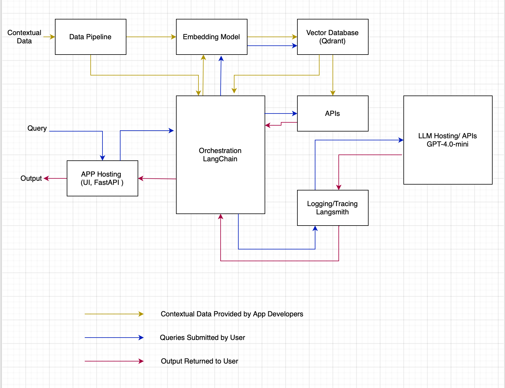

### Task 1: Articulate the problem and the user of your application

1. Write a succinct 1-sentence description of the problem

Our app helps first-time Bay Area home buyers identify red flags in inspection reports—a crucial step for buyers with limited property access before purchase.

2. Write 1-2 paragraphs on why this is a problem for your specific user

The housing stock is dominated by homes built in the 1950s and 1960s, and many require ongoing maintenance. Demand is strong, so listings move quickly—often selling within one to two weeks. Prices are high, which makes the stakes even greater and leaves buyers little room for mistakes.

Buyers must act quickly while juggling many property decisions and a large amount of documentation. Time to inspect and understand a property before making an offer is limited. First-time buyers face an added challenge: they often don’t know which issues to look for or how to evaluate a home, making it harder to make an informed decision under pressure.

3. Create a list of questions or input-output pairs that you can use to evaluate your application

Q: Find out the red flags in propery inspection report
A: Here are red flags from the inspection report, in order of Critical, Major and Minor

Q. List schools and their rating
A. School Quality for 1455 Bittern Dr, Sunnyvale, CA <list of schoold and their ratings>

Q. How is neighborhood 
A. The neighborhood is described as charming and well-located, with close proximity to local amenities, schools, and commuter routes. It is situated near Apple Park, which is a significant landmark in the area, indicating a desirable location.

### Task 2: Articulate your proposed solution

1. Write 1-2 paragraphs on your proposed solution.  How will it look and feel to the user? Describe the tools you plan to use to build it.

Proposed Solution: 

AI Realtor is a chat-based app that helps users find red flags in home inspection reports. Users first see a landing page with the tagline “Property Analyzer” and a short “How it works” flow (Enter Property → Upload Report → Get Analysis). They enter a property address, upload a PDF inspection report (sent to the backend for ingestion), and choose focus areas from categories such as Home Structure (Foundation, Roof, Water Damage, Mold), Home Systems (Plumbing, Electrical, HVAC), Home Details (Appliances, Windows, Flooring), and Neighborhood (School Quality, Walkability, Safety). Custom priorities are supported. After submit, they move to a chat panel where they can ask natural-language questions; responses stream in real time, show severity labels (Critical / Major / Minor), and include page citations from the report. Conversation history is persisted so users can follow up without re-explaining context.

Tech stack and architecture: The frontend uses Next.js 16 with React 19, shadcn/ui (Radix), Tailwind CSS, react-markdown, and Lucide icons. The backend is FastAPI and Uvicorn, with a LangGraph ReAct agent driven by GPT-4o-mini (via LangChain/OpenAI). PDFs are processed with pypdf, chunked by page, embedded with OpenAI, and stored in Qdrant. The agent uses three tools: search_red_flag_guidelines and search_inspection_report (vector retrieval from reference docs and user reports) and web_search (Tavily) for schools, neighborhood, and area info. Optional Cohere reranking improves relevance. Redis stores chat threads. Together, this forms a RAG-based system with streaming, tool use, and multi-turn conversation.

2.  Create an infrastructure diagram of your stack showing how everything fits together.  Write one sentence on why you made each tooling choice.
    1. LLM(s)
    2. Agent orchestration framework 
    3. Tool(s)
    4. Embedding model
    5. Vector Database
    6. Monitoring tool
    7. Evaluation framework
    8. User interface
    9. Deployment tool
    10. Any other components you need

3. What are the RAG and agent components of your project, exactly?

## RAG Components

| Component | Location | Purpose |
|-----------|----------|---------|
| **Chunker** | `rag/chunker.py` | Splits each PDF page into overlapping chunks (500 chars, 50 overlap). `chunk_by_pages()` preserves page numbers (1-indexed) for later citations. |
| **Embedder** | `rag/embedder.py` | Converts text to vectors using `text-embedding-3-small` (1536 dimensions). Exposes `embed_text()` and `embed_batch()`. |
| **Store** | `rag/store.py` | Qdrant vector database with two collections: `reference_guidelines` (backend/data PDFs) and `user_reports` (uploaded reports). Cosine similarity search via `search()`. |
| **Retriever** | `rag/retriever.py` | `retrieve_from_reference()` and `retrieve_from_report()` embed the query, run `search()`, and format results as `[N] source — Page X\n<text>`. |
| **Retriever (Cohere)** | `rag/retriever_cohere.py` | Cohere-reranked versions that retrieve more candidates, rerank with `rerank-english-v3.0`, and return the top-k. Used when the base search is too noisy. |

**RAG pipeline:** PDF → `extract_pages_from_pdf` (pypdf) → `chunk_by_pages` → `embed_batch` → `upsert_chunks` into Qdrant. Query path: embed query → `search` → (optional rerank) → formatted chunks returned to the agent.

---

## Agent Components

| Component | Location | Purpose |
|-----------|----------|---------|
| **Agent** | `agent.py` | LangGraph ReAct agent via `create_react_agent()`. Uses GPT-4o-mini. `run_agent()` streams tokens with `agent.astream()` (`stream_mode="messages"`). |
| **System Prompt** | `agent.py` | Defines tool use (RAG vs web search), severity ordering, page citations, user preferences, and follow-up behavior. |
| **Tools** | `tools.py` | LangChain tools: `search_red_flag_guidelines`, `search_inspection_report`, `web_search` (Tavily). Optional Cohere variants: `search_red_flag_guidelines_advanced`, `search_inspection_report_advanced`. |
| **Orchestration** | `routers/chat.py` | Accepts chat request, loads history from Redis, calls `run_agent()`, streams SSE, writes new messages to Redis. |

**Agent flow:** User message (+ context) → `run_agent()` → ReAct loop (LLM chooses tools, calls them, uses results) → streams answer. RAG tools supply reference and inspection content; web search supplies schools, neighborhood, etc.

### Task 3: Collect your own data (RAG) and choose at least one external API to use (Agent)
  
1. Describe the default chunking strategy that you will use for your data.  Why did you make this decision?

## Default Chunking Strategy

**Page-aware chunking** with:

| Parameter | Value | Description |
|-----------|-------|-------------|
| **Chunk size** | 500 characters | Max characters per chunk |
| **Overlap** | 50 characters | Shared characters between adjacent chunks |
| **Unit** | Page | Chunking happens **per page**; each chunk keeps its page number |

**Flow:**
1. PDF text is taken page-by-page.
2. Each page is split into overlapping segments of 500 characters with 50-character overlap.
3. Each chunk is stored as `{"text": str, "page_number": int}` (page numbers are 1-indexed).
4. Chunks are embedded and stored in Qdrant with `source` and `page_number` in the payload.

---

## Why These Choices?

**1. Page-aware chunking**

Inspection reports are page-based, and users expect citations like “page 7.” By chunking within pages and storing `page_number`, the retriever can return exact page references so the agent can say “found on page 7” instead of generic citations.

**2. 500-character chunks**

- Keeps chunks small enough for the LLM context while still holding whole findings (e.g., issue + description).
- Many inspection findings fit in 1–2 short paragraphs, so 500 characters limits splitting a single finding across chunks.
- Balances specificity (less noise per chunk) with enough context to interpret the finding.

**3. 50-character overlap**

- Reduces the chance of cutting a finding in the middle.
- Preserves continuity around boundaries (e.g., “defect” and its description in the same chunk).
- 50 characters adds useful overlap without too much duplication.

**4. Character-based splitting**

- No sentence or paragraph logic: character boundaries are simple and robust across layouts (bullets, lists, tables).
- Overlap helps compensate for possible cuts in the middle of words or sentences.

2. Describe your data source and the external API you plan to use, as well as what role they will play in your solution. Discuss how they interact during usage. 

## Data Sources

### 1. Reference Guidelines

- **Source:** PDF files in `backend/data/`
- **Content:** Expert home-inspection red-flag guidance (foundation, roof, plumbing, electrical, HVAC, water damage, mold, structural, septic)
- **Ingestion:** At backend startup via `auto_ingest_data_dir()`
- **Storage:** Qdrant collection `reference_guidelines`
- **Role:** Defines what to look for; used internally and not cited to users

### 2. User Inspection Reports

- **Source:** PDF uploads via the frontend (`POST /api/ingest`)
- **Content:** Property-specific inspection report
- **Ingestion:** On upload: extract text → chunk → embed → upsert
- **Storage:** Qdrant collection `user_reports`
- **Role:** Source of findings and page citations; cited answers come from this report

---

## External APIs and Services

| Service | Role |
|---------|------|
| **OpenAI** | LLM (`gpt-4o-mini`) and embeddings (`text-embedding-3-small`); powers the agent and RAG retrieval |
| **Qdrant** | Vector store for reference and user chunks; semantic search |
| **Redis** | Chat history per `thread_id` for multi-turn conversations |
| **Tavily** | Web search for schools, neighborhood, walkability, safety, amenities when the report lacks this data |
| **Cohere** | Optional reranking of RAG results when retrieval is noisy |

---

## How They Interact During Usage

1. **Ingestion (startup):** Reference PDFs in `backend/data/` are extracted, chunked, embedded with OpenAI, and stored in Qdrant.

2. **User upload:** Inspection report PDF is extracted, chunked, embedded, and stored in Qdrant’s `user_reports` collection.

3. **Chat request:** User asks questions (e.g., roof issues, schools). If a `thread_id` exists, conversation history is loaded from Redis.

4. **Agent loop:** The LLM selects tools:
   - **Property/structure:** `search_red_flag_guidelines` and `search_inspection_report` query Qdrant; optional Cohere reranking.
   - **Schools, neighborhood, etc.:** `web_search` (Tavily) with the property address in the query.

5. **Retrieval flow:** Query is embedded with OpenAI → Qdrant search → optional Cohere rerank → formatted chunks sent to the LLM.

6. **Response:** LLM combines tool outputs, orders by severity, cites page numbers from the user report, and streams the answer. New messages are saved to Redis for the thread.

---

**Summary:** Two data sources (reference guidelines and user inspection reports), plus external services for LLM, embeddings, vector search, chat persistence, web search, and optional reranking. They interact through the ReAct agent: RAG tools retrieve from Qdrant; the web search tool calls Tavily; and the LLM synthesizes all outputs into the final answer.

### Task 4: Build an end-to-end Agentic RAG application using a production-grade stack and your choice of commercial off-the-shelf model(s)

**✅ Deliverables**

1. Build an end-to-end prototype and deploy it to a *local* endpoint
2. (Optional) Use locally-hosted OSS models instead of LLMs through the OpenAI API
3. (Optional) Deploy your prototype to public endpoint using a tool like [Vercel](http://vercel.com/), [Render](https://render.com/), or [FastAPI Cloud](https://fastapicloud.com/)

### Task 5: Prepare a test data set (either by generating synthetic data or by assembling an existing dataset) to baseline an initial evaluation with RAGAS

1. Assess your pipeline using the RAGAS framework, including the following key metrics: faithfulness, context precision, and context recall. Include any other metrics you feel are worthwhile to assess.   Provide a table of your output results.

### Overall RAGAS Scores

| Metric | Score | Interpretation |
|--------|-------|----------------|
| **Answer Relevancy** | **0.977** | Strong — answers closely match user questions |
| **Answer Correctness** | **0.65** | Moderate — answers partially align with reference |
| **Context Precision** | 0.62 | Moderate — ~62% of retrieved chunks are relevant |
| **Context Recall** | 0.48 | Moderate — ~48% of reference content retrieved |
| **Faithfulness** | 0.49 | Moderate — answers are ~halfway grounded in retrieved context |

### Tool Usage

- **11 of 12** samples made tool calls (`search_red_flag_guidelines`, `search_inspection_report`, `web_search`).
- **1** sample with no tool calls: *"What does the term 'Red Flags Property' refer to?"* — answered from model knowledge.

### Per-Sample Breakdown

| # | Question Topic | Prec | Recall | Faith | Relevancy | Correctness | Notes |
|---|----------------|------|--------|-------|-----------|-------------|-------|
| 1 | Red Flags Property term | 0 | 0 | 0 | **0.996** | 0.70 | No tools used |
| 2 | Foundation defects | 0 | 0 | 0 | 0.99 | **0.22** | Poor retrieval (repeated "structural defect") |
| 3 | Fire/explosion hazards | 1.0 | 0.5 | 0.29 | 0.96 | 0.43 | Model adds content beyond retrieval |
| 4 | Young structures | 1.0 | **1.0** | 0.67 | 0.96 | 0.59 | Strong retrieval |
| 5 | Smoke detectors | 1.0 | **1.0** | 0.79 | 0.95 | 0.80 | Strong |
| 6 | Wall cracks | 1.0 | 0.5 | **0.87** | **0.99** | **0.88** | Best sample |
| 7 | Retaining walls | 1.0 | 0 | 0 | 0.98 | 0.82 | Retrieval off-target (reference mentions buckling) |
| 8 | Ventilation & drainage | 1.0 | 0.75 | 0.63 | 0.99 | 0.72 | Good |
| 9 | Hazardous vegetation + doors | 1.0 | **1.0** | **0.90** | **1.0** | **0.99** | Strong |
| 10 | Hazardous materials + safety glass | 0 | 0 | 0.28 | 0.99 | 0.39 | Retrieval miss |
| 11 | Hazardous materials red flags | 0 | 0 | 0.44 | 0.95 | 0.31 | Retrieval miss |
| 12 | Smoke detectors + sagging beams | 0.5 | **1.0** | **1.0** | 0.97 | **0.99** | Strong |

2. What conclusions can you draw about the performance and effectiveness of your pipeline with this information?

## Conclusions: Pipeline Performance and Effectiveness

### 1. The Pipeline is Generally Effective

- **Answer relevancy (0.97)** — The agent produces relevant answers across a range of topics (foundation, smoke detectors, wall cracks, hazmat, etc.), including typos.
- **Strong tool usage** — With the eval prompt, 11/12 (base) and 12/12 (advanced) samples use tools instead of answering from memory.
- **Strong samples (0.88–0.99 correctness)** — Wall cracks, hazardous vegetation + doors, and smoke detectors + sagging beams show that when retrieval works, grounding and correctness are high.

**Conclusion:** The ReAct agent, Qdrant retrieval, and tool setup behave as intended when retrieval is sufficient.

---

### 2. Retrieval is the Main Bottleneck

- **Context recall (0.48)** — Only about half of the relevant reference content is retrieved.
- **Context precision (0.62)** — A non-trivial share of retrieved chunks is not useful.
- **Weak-performing topics** — Foundation defects, hazmat, and “Red Flags Property” all fail at retrieval:
  - Foundation: retrieval returns repeated “structural defect” instead of the full list (cracks, sloping floors, etc.).
  - Hazmat: reference material on classifications and disposal is not retrieved.
  - “Red Flags Property”: agent skips tools and answers from memory.

**Conclusion:** Chunking, indexing, and retrieval likely matter more than the agent itself.

---

### 3. Faithfulness Tracks Retrieval Quality

- When retrieval is good (samples 5, 6, 9, 12): faithfulness is 0.79–1.0.
- When retrieval is poor (samples 2, 10, 11): faithfulness drops to 0.28–0.44.

**Conclusion:** The model stays faithful to the retrieved context. Low faithfulness reflects weak retrieval more than hallucination, so improvements should focus on retrieval and indexing.

---

### 4. Answer Correctness Reflects Retrieval Plus Reference Alignment

- Correctness rises when retrieval is good.
- Advanced has slightly lower correctness (0.65 → 0.61) despite higher faithfulness.
- Reference answers may be tuned to base retrieval; Cohere’s narrower context can change what the model says, leading to lower overlap with the reference.

**Conclusion:** Correctness scores reflect alignment with the reference and retrieval quality. They are not a pure measure of factual accuracy.

---

### 6. The Eval-Specific Prompt Works

- Before: ~8/12 samples had no tool calls.
- After: 11/12 (base) and 12/12 (advanced) use tools.
- Mandating “always use tools first” for inspection questions raises tool use without affecting production behavior.

---

### Summary

The pipeline works when retrieval is solid. Retrieval quality (chunking and search) is the main limit, not the agent. Cohere reranking improves retrieval and grounding. Foundation and hazmat need targeted retrieval work before they can be fully trusted.

### Task 6: Install an advanced retriever of your choosing in our Agentic RAG application

1. Choose an advanced retrieval technique that you believe will improve your application’s ability to retrieve the most appropriate context.  Write 1-2 sentences on why you believe it will be useful for your use case.

## Advanced Retriever Technique: Cohere Rerank

### Two-Stage Retrieve-Then-Rerank

The application uses **Cohere Rerank** as its advanced retrieval technique — a two-stage pipeline that combines dense vector search with cross-encoder reranking.

### How It Works

1. **Stage 1 — Dense vector search (Qdrant)**  
   The query is embedded and used to search the vector store by cosine similarity. Retrieval is over-fetched: the pipeline pulls `candidate_factor × top_k` candidates (at least 20).

2. **Stage 2 — Cohere reranking**  
   The candidate chunks are sent to Cohere’s rerank API (model: `rerank-english-v3.0`), which scores each query–document pair for relevance. Only the top `top_k` results are returned.

### Why It Improves Retrieval

- **Vector search alone** returns chunks with high semantic similarity, but not always the most relevant answer.
- **Cohere rerank** uses a cross-encoder model to score query–document relevance more directly.
- **Two-stage design** keeps cost and latency reasonable by reranking only a small candidate set instead of the full corpus.

### Where It’s Used

| Base (vector only) | Advanced (with rerank) |
|--------------------|------------------------|
| `search_red_flag_guidelines` | `search_red_flag_guidelines_advanced` |
| `search_inspection_report` | `search_inspection_report_advanced` |

2. Implement the advanced retrieval technique on your application.
3. How does the performance compare to your original RAG application? Test the new retrieval pipeline using the RAGAS frameworks to quantify any improvements. Provide results in a table.

## Performance Comparison: Base vs Advanced Retrieval Pipeline

Using **eval_results_agent.json** and **eval_results_advanced.json**, RAGAS evaluation of the base (vector-only) and advanced (Cohere rerank) pipelines gives:

---

### RAGAS Results

| Metric | Base (Vector Search) | Advanced (Cohere Rerank) | Change |
|--------|----------------------|---------------------------|--------|
| **Context Precision** | 0.625 | **0.750** | **+20.0%** |
| **Context Recall** | 0.479 | **0.611** | **+27.6%** |
| **Faithfulness** | 0.488 | **0.524** | **+7.4%** |
| **Answer Relevancy** | 0.977 | 0.976 | −0.1% |
| **Answer Correctness** | 0.653 | **0.685** | **+4.9%** |

---

### Pipeline Configuration

| | Base | Advanced |
|---|------|----------|
| **Retrieval** | Qdrant vector search (cosine similarity) | Qdrant vector search + Cohere rerank |
| **Tools** | `search_red_flag_guidelines`, `search_inspection_report`, `web_search` | `search_red_flag_guidelines_advanced`, `search_inspection_report_advanced`, `web_search` |
| **Top-k** | 5 | 3 (after reranking 12+ candidates) |

---

### Summary

- **Context precision** and **context recall** improve with Cohere rerank, indicating better retrieval.
- **Faithfulness** improves (0.488 → 0.524), so answers are better grounded in context.
- **Answer correctness** improves (0.653 → 0.685).
- **Answer relevancy** stays essentially the same (~0.976).

**Conclusion:** The advanced (Cohere rerank) pipeline outperforms the base vector search on retrieval and grounding, with the largest gains in context precision (+20%) and context recall (+28%).

### Task 7: Next Steps

You are the **AI Solutions Engineer** working with the **AI Evaluation & Performance Engineer**. 

1. Do you plan to keep your RAG implementation via Dense Vector Retrieval for Demo Day? Why or why not?

I will keep dense vector retrieval as the baseline, with Cohere rerank as an optional upgrade when available.

Reasons:

### 1. Dense retrieval is a solid fallback

- Answer relevancy is strong (0.977).
- 11/12 eval samples use tools correctly.
- Some samples (wall cracks, hazardous vegetation, smoke detectors) reach 0.88–0.99 correctness.
- No external APIs beyond Qdrant and OpenAI, so simpler setup and fewer failure points.

### 2. Cohere rerank improves retrieval and grounding

- Context precision +20%, context recall +28%.
- Better faithfulness and answer correctness.
- Helps on weak topics (foundation, hazmat).

### 3. Current implementation already supports both

- `agent.py` uses `get_tools()`, which adds advanced tools only when `COHERE_API_KEY` is set.
- If the key is set → advanced (vector + Cohere) tools are used.
- If not set → base (vector-only) tools are used.

# Your Final Submission

Please include the following in your final submission:

1. A public (or otherwise shared) link to a **GitHub repo** that contains:
- A 5-minute (OR LESS) Loom video of a live **demo of your application** that also describes the use case.
- A **written document** addressing each deliverable and answering each question
- All relevant code
