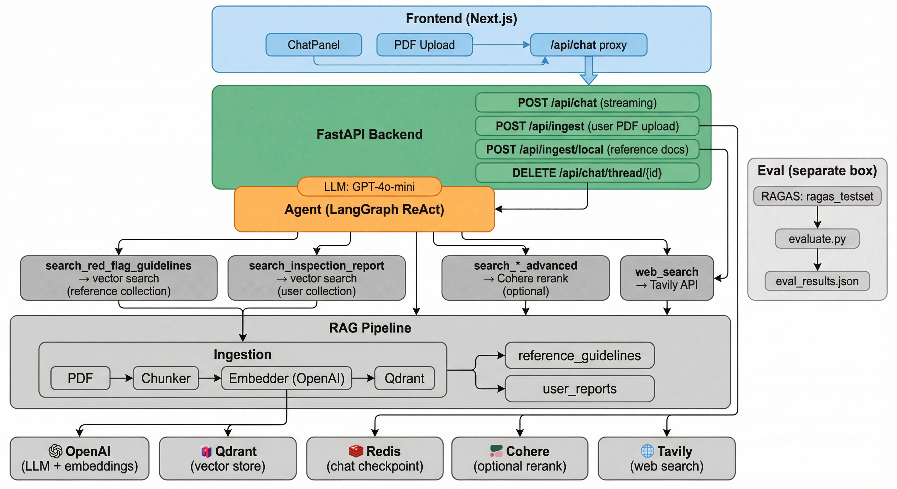

# AI Realtor

A streaming AI chat application for home inspection analysis with a Next.js frontend and FastAPI backend.

## Architecture



| Layer | Components |
|-------|------------|
| **Frontend** | Next.js app: ChatPanel, PDF upload; proxies `/api/chat` to backend |
| **Backend** | FastAPI: `/api/chat` (SSE streaming), `/api/ingest` (user PDFs), `/api/ingest/local` (reference docs) |
| **Agent** | LangGraph ReAct agent (GPT-4o-mini) with tools for RAG + web search |
| **Tools** | `search_red_flag_guidelines`, `search_inspection_report`; optional Cohere-reranked variants; `web_search` (Tavily) |
| **RAG** | PDF → Chunker → Embedder (OpenAI) → Qdrant; collections: `reference_guidelines`, `user_reports` |
| **Persistence** | Redis (chat history per `thread_id`); Qdrant (vector store) |
| **External** | OpenAI (LLM + embeddings), Qdrant, Redis, Cohere (optional), Tavily |
| **Eval** | RAGAS: `evaluate.py` (RAG/agent) → `eval_results*.json`; `evaluate_advanced.py` (Cohere rerank) → `eval_results_advanced.json` |

## Project Structure

```
ai-realtor/
├── backend/
│   ├── main.py              # FastAPI app entry point
│   ├── routers/
│   │   └── chat.py          # /api/chat streaming endpoint
│   ├── requirements.txt
│   └── .env.example         # Copy to .env and add your API keys
├── eval/                     # RAGAS evaluation for RAG and agent
│   ├── evaluate.py           # RAG chain or agent mode (--agent)
│   ├── evaluate_advanced.py   # Agent with Cohere reranked tools
│   ├── generate_testset.py   # Generate synthetic test set from docs
│   ├── json_to_pdf.py        # Export test set to PDF report
│   ├── pyproject.toml        # Python deps (ragas, langchain, openai)
│   └── data/
│       ├── ragas_testset.json       # Pre-built RAGAS test set (questions + references)
│       ├── ragas_testset.pdf        # Human-readable test set report
│       ├── eval_results.json        # RAG chain output
│       ├── eval_results_agent.json  # Agent mode output (evaluate.py --agent)
│       ├── eval_results_advanced.json  # Advanced agent output (Cohere rerank)
│       └── home_inspection_reference.txt  # Fallback doc when no PDFs
└── frontend/
    ├── public/
    │   └── index.html
    └── src/
        ├── App.jsx
        ├── components/
        │   ├── ChatInput.jsx
        │   └── ChatResponse.jsx
        └── hooks/
            └── useStreamingChat.js   # Core streaming logic (TODO)
```

## Getting Started

### Backend

```bash
cd backend

# Install dependencies (uv creates .venv automatically)
uv sync

# For local development:
cp .env.example .env.local   # edit with your local API keys

# For production/web deployment:
cp .env.example .env         # edit with your production API keys

# Run the server
uv run uvicorn main:app --reload
```

### Frontend

```bash
cd frontend
npm install
npm start
```

## Evaluation (RAGAS)

The `eval/` directory contains RAGAS-based evaluation for the RAG pipeline and agent. See [eval/README.md](eval/README.md) for setup and workflow.

- **Setup:** `cd eval && uv sync` (requires `OPENAI_API_KEY`)
- **RAG chain:** `uv run python evaluate.py` → `data/eval_results.json`
- **Agent mode:** `uv run python evaluate.py --agent` → `data/eval_results_agent.json` (uses `search_red_flag_guidelines`, `search_inspection_report`, `web_search`; requires Qdrant)
- **Advanced agent:** `uv run python evaluate_advanced.py` → `data/eval_results_advanced.json` (uses Cohere reranked tools; requires `COHERE_API_KEY` and Qdrant)
- **Generate test set:** `uv run python generate_testset.py` (optional, pre-built set included)

## What to implement

- [ ] `backend/routers/chat.py` — wire up LLM streaming in `stream_llm_response()`
- [ ] `frontend/src/hooks/useStreamingChat.js` — implement the streaming fetch loop
- [ ] `frontend/src/App.jsx` — connect `handleSubmit` to `sendMessage`
- [ ] `frontend/src/components/ChatInput.jsx` — add Enter key submit
- [ ] Future: PDF upload endpoint + extract text before sending to LLM
